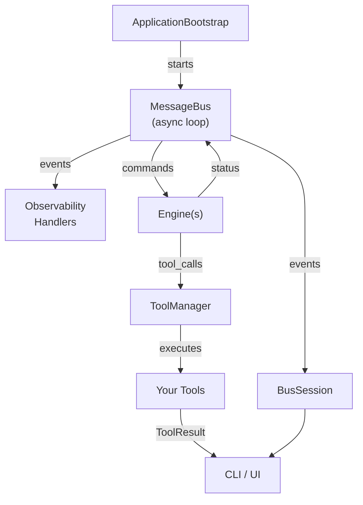

# DSCubed AI Winter: Enhanced LLMgine Engine

> **Lean, tool‑augmented chat engine for LLMgine—features automatic short‑term memory summarisation, plug‑and‑play tool calls, and a CLI for rapid prototyping of production‑grade AI assistants.**

## 🌟 New in This Fork

### ✨ What’s New

- **Automatic Short‑Term Memory Summarisation**
  - Keeps conversations under `MAX_CONTEXT_TOKENS` by condensing the oldest `PRUNE_TARGET_TOKENS` into a single assistant “summary” message.
  - Triggered transparently before each LLM call—no user action required.

- **Token‑Aware Slice Selection**
  - Uses a lightweight `tiktoken`‑based helper (`llmgine.utils.token_count`) to measure *tokens*, not characters, ensuring accurate context budgeting.

- **`MemorySummarisedEvent`**
  - Emits `removed_tokens` → `summary_tokens` metrics to the message‑bus.
  - Optional CLI hook lets users see when condensation occurs.

- **Plug‑and‑Play Configuration**
  - Global constants in `llmgine.settings` (`MAX_CONTEXT_TOKENS`, `PRUNE_TARGET_TOKENS`) let you tweak limits without touching engine code.

- **Zero‑Downtime Integration**
  - Drops into `ToolChatEngine` with two helper methods and one `_maybe_summarise_history()` coroutine.
  - Works alongside the existing tool‑execution loop; no API changes for end‑users.

# 🌌 **LLMgine**

LLMgine is a _pattern-driven_ framework for building **production-grade, tool-augmented LLM applications** in Python.  
It offers a clean separation between _**engines**_ (conversation logic), _**models/providers**_ (LLM back-ends), _**tools**_ (function calling), a streaming **message-bus** for commands & events, and opt-in **observability**.  
Think _FastAPI_ for web servers or _Celery_ for tasks—LLMgine plays the same role for complex, chat-oriented AI.

---

## ✨ Feature Highlights
| Area | What you get | Key files |
|------|--------------|-----------|
| **Engines** | Plug-n-play `Engine` subclasses (`SinglePassEngine`, `ToolChatEngine`, …) with session isolation, tool-loop orchestration, and CLI front-ends | `engines/*.py`, `src/llmgine/llm/engine/` |
| **Message Bus** | Async **command bus** (1 handler) + **event bus** (N listeners) + **sessions** for scoped handlers | `src/llmgine/bus/` |
| **Tooling** | Declarative function-to-tool registration, multi-provider JSON-schema parsing (OpenAI, Claude, DeepSeek), async execution pipeline | `src/llmgine/llm/tools/` |
| **Providers / Models** | Wrapper classes for OpenAI, OpenRouter, Gemini 2.5 Flash etc. _without locking you in_ | `src/llmgine/llm/providers/`, `src/llmgine/llm/models/` |
| **Context Management** | Simple and in-memory chat history managers, event-emitting for retrieval/update | `src/llmgine/llm/context/` |
| **UI** | Rich-powered interactive CLI (`EngineCLI`) with live spinners, confirmation prompts, tool result panes | `src/llmgine/ui/cli/` |
| **Observability** | Console + JSONL file handlers, per-event metadata, easy custom sinks | `src/llmgine/observability/` |
| **Bootstrap** | One-liner `ApplicationBootstrap` that wires logging, bus startup, and observability | `src/llmgine/bootstrap.py` |

---

## 🏗️ High-Level Architecture



*Every component communicates _only_ through the bus, so engines, tools, and UIs remain fully decoupled.*

---

## 🚀 Quick Start

### 1. Install

```bash
git clone https://github.com/your-org/llmgine.git
cd llmgine
python -m venv .venv && source .venv/bin/activate
pip install -e ".[openai]"   # extras: openai, openrouter, dev, …
export OPENAI_API_KEY="sk-…" # or OPENROUTER_API_KEY / GEMINI_API_KEY
```

### 2. Run the demo CLI

```bash
python -m llmgine.engines.single_pass_engine  # pirate translator
# or
python -m llmgine.engines.tool_chat_engine    # automatic tool loop
```

You’ll get an interactive prompt with live status updates and tool execution logs.

---

## 🧑‍💻 Building Your Own Engine

```python
from llmgine.llm.engine.engine import Engine
from llmgine.messages.commands import Command, CommandResult
from llmgine.bus.bus import MessageBus

class MyCommand(Command):
    prompt: str = ""

class MyEngine(Engine):
    def __init__(self, session_id: str):
        self.session_id = session_id
        self.bus = MessageBus()

    async def handle_command(self, cmd: MyCommand) -> CommandResult:
        await self.bus.publish(Status("thinking", session_id=self.session_id))
        # call LLM or custom logic here …
        answer = f"Echo: {cmd.prompt}"
        await self.bus.publish(Status("finished", session_id=self.session_id))
        return CommandResult(success=True, result=answer)

# Wire into CLI
from llmgine.ui.cli.cli import EngineCLI
chat = EngineCLI(session_id="demo")
chat.register_engine(MyEngine("demo"))
chat.register_engine_command(MyCommand, MyEngine("demo").handle_command)
await chat.main()
```

---

## 🔧 Registering Tools in 3 Lines

```python
from llmgine.llm.tools.tool import Parameter
from llmgine.engines.tool_chat_engine import ToolChatEngine

def get_weather(city: str):
    """Return current temperature for a city.
    Args:
        city: Name of the city
    """
    return f"{city}: 17 °C"

engine = ToolChatEngine(session_id="demo")
await engine.register_tool(get_weather)               # ← introspection magic ✨
```

The engine now follows the **OpenAI function-calling loop**:

```
User → Engine → LLM (asks to call get_weather) → ToolManager → get_weather()
          ↑                                        ↓
          └───────────    context update   ────────┘ (loops until no tool calls)
```

---

## 📰 Message Bus in Depth

```python
from llmgine.bus.bus import MessageBus
from llmgine.bus.session import BusSession

bus = MessageBus()
await bus.start()

class Ping(Command): pass
class Pong(Event): msg: str = "pong!"

async def ping_handler(cmd: Ping):
    await bus.publish(Pong(session_id=cmd.session_id))
    return CommandResult(success=True)

with bus.create_session() as sess:
    sess.register_command_handler(Ping, ping_handler)
    sess.register_event_handler(Pong, lambda e: print(e.msg))
    await sess.execute_with_session(Ping())      # prints “pong!”
```

*Handlers are **auto-unregistered** when the `BusSession` exits—no leaks.*

---

## 📊 Observability

Add structured logs with zero boilerplate:

```python
from llmgine.bootstrap import ApplicationBootstrap, ApplicationConfig
config = ApplicationConfig(enable_console_handler=True,
                           enable_file_handler=True,
                           log_level="debug")
await ApplicationBootstrap(config).bootstrap()
```

*All events/commands flow through `ConsoleEventHandler` and `FileEventHandler`
to a timestamped `logs/events_*.jsonl` file.*

---

## 📁 Repository Layout (abridged)

```
llmgine/
│
├─ engines/            # Turn-key example engines (single-pass, tool chat, …)
└─ src/llmgine/
   ├─ bus/             # Message bus core + sessions
   ├─ llm/
   │   ├─ context/     # Chat history & context events
   │   ├─ engine/      # Engine base + dummy
   │   ├─ models/      # Provider-agnostic model wrappers
   │   ├─ providers/   # OpenAI, OpenRouter, Gemini, Dummy, …
   │   └─ tools/       # ToolManager, parser, register, types
   ├─ observability/   # Console & file handlers, log events
   └─ ui/cli/          # Rich-based CLI components
```

---

## 🏁 Roadmap

- [ ] **Streaming responses** with incremental event dispatch  
- [ ] **WebSocket / FastAPI** front-end (drop-in replacement for CLI)  
- [ ] **Persistent vector memory** layer behind `ContextManager`  
- [ ] **Plugin system** for third-party Observability handlers  
- [ ] **More providers**: Anthropic, Vertex AI, etc.

---

## 🤝 Contributing

1. Fork & create a feature branch  
2. Ensure `pre-commit` passes (`ruff`, `black`, `isort`, `pytest`)  
3. Open a PR with context + screenshots/GIFs if UI-related  

---

## 📄 License

LLMgine is distributed under the **MIT License**—see [`LICENSE`](LICENSE) for details.

---

> _“Build architecturally sound LLM apps, not spaghetti code.  
> Welcome to the engine room.”_
